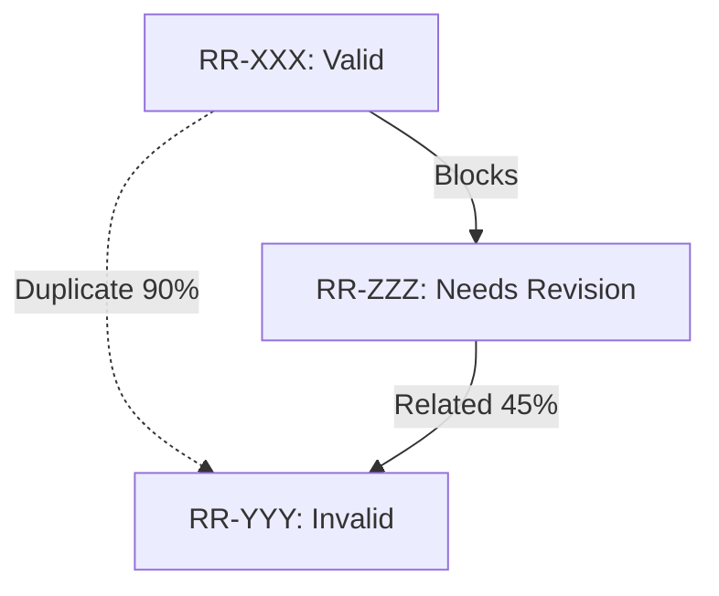

# Step 1: Audit - Deep Validation & Root Cause Analysis

Comprehensive Linear issue validation system that performs unbiased investigation, validates root causes, and provides actionable recommendations. Features sequential multi-agent analysis optimized for batching, historical context validation, and fresh investigation capabilities.

## Help Mode

If user provides `--help` or `help` parameter, display this usage guide:

```
01-audit - Step 1: Comprehensive Linear issue validation and root cause analysis

USAGE:
  01-audit RR-123                  Audit single issue
  01-audit RR-123 RR-456           Audit 2 issues with relationship analysis
  01-audit RR-123 RR-456 RR-789   Audit 3 issues (maximum)
  01-audit help                    Show this help

FEATURES:
  • Deep root cause validation assuming incomplete original analysis
  • Sequential multi-agent domain analysis optimized for batching with confidence scoring
  • Historical correlation with git commits and CHANGELOG
  • Cross-issue relationship detection (when multiple issues provided)
  • Interactive fresh investigation option after initial analysis
  • Selective agent re-invocation for accuracy refinement
  • External validation via Codex MCP

MULTI-ISSUE ANALYSIS:
  When multiple issues are provided (max 3):
  • Each issue receives individual comprehensive audit
  • Cross-issue relationships automatically detected
  • Identifies potential duplicates between provided issues
  • Determines optimal execution order if dependencies exist
  • Highlights shared code areas and overlapping solutions

EXAMPLES:
  01-audit RR-275
  01-audit RR-275 RR-294 RR-273
  01-audit help
```

## Phase 1: Input Validation & Mode Detection

### Step 1.1: Parse and Validate Input

```bash
# Parse arguments into array
ARGS_ARRAY=($ARGUMENTS)

# Check for help
if [[ "${ARGS_ARRAY[0]}" == "help" ]] || [[ "${ARGS_ARRAY[0]}" == "--help" ]]; then
  # Display help and exit
  exit 0
fi

# Validate issue count
ISSUE_COUNT=${#ARGS_ARRAY[@]}

if [ $ISSUE_COUNT -eq 0 ]; then
  echo "❌ Error: No issue ID provided"
  echo "Usage: 01-audit <issue-id> [issue-id-2] [issue-id-3]"
  exit 1
fi

if [ $ISSUE_COUNT -gt 3 ]; then
  echo "❌ Error: Maximum 3 issues can be audited at once"
  echo "You provided $ISSUE_COUNT issues: ${ARGS_ARRAY[@]}"
  echo "Please run with 3 or fewer issues"
  exit 1
fi

# Extract issue IDs
ISSUE_1="${ARGS_ARRAY[0]}"
ISSUE_2="${ARGS_ARRAY[1]:-}"
ISSUE_3="${ARGS_ARRAY[2]:-}"

# Display audit scope
if [ $ISSUE_COUNT -eq 1 ]; then
  echo "📋 Auditing single issue: $ISSUE_1"
else
  echo "📋 Auditing $ISSUE_COUNT issues: ${ARGS_ARRAY[@]}"
  echo "🔗 Cross-issue relationship analysis will be performed"
fi
```

### Step 1.2: Initialize Investigation

- **Initial Analysis**: Ultrathink and do a comprehensive analysis using existing context and findings
- **Interactive Option**: After initial analysis, think hard & offer fresh investigation choice

## Phase 1.5: Batched Multi-Issue Context Gathering (If Multiple Issues)

**Note: MCP servers execute sequentially. Optimize by batching where possible.**

### Step 1.5A: Batch Linear Analysis

**Execute as single batched request to linear-expert:**

```
Task: Gather context for multiple issues in single operation

Request batch analysis for: [${ARGS_ARRAY[@]}]

Return consolidated data:
- All issue details with comments
- All parent/child relationships
- Cross-issue relationships
- Metadata for all issues

Note: Linear MCP will process these sequentially but return consolidated results.
```

### Step 1.5B: Sequential Code Impact Analysis

**Use Serena MCP efficiently (sequential execution):**

```
Task: Analyze code impact for multiple issues

Process each issue sequentially but efficiently:
1. Build single search query covering all issue keywords
2. Perform one comprehensive symbol search
3. Map results to respective issues
4. Identify overlaps in single pass

Note: Serena operations are sequential - optimize queries for efficiency.
```

## Phase 2: Comprehensive Multi-Agent Domain Analysis

### Step 2.1: Agent Execution Strategy

**IMPORTANT: MCP agents execute sequentially, not in parallel.**

**Optimization Strategy:**

- Batch related queries to minimize round trips
- Use comprehensive prompts to get complete responses
- Leverage agent memory/context between calls
- Group similar domain analyses

### Step 2.2: Sequential Agent Execution with Batching

Execute agents in optimal sequence, batching where possible:

```
Execution Order (optimized for dependencies):

1. **Serena MCP** (First - provides codebase context for others):
   - Get symbols, patterns, and code structure
   - Single comprehensive search query

2. **linear-expert** (Early - provides issue context):
   - Batch request for all issue data if multiple issues
   - Include related issues in single call

3. **git-expert** (Early - provides change context):
   - Batch multiple git commands in single call
   - Combine log, diff, status operations

4. **Database Analysis** (db-expert-readonly):
   - Single comprehensive schema analysis
   - Include all tables/queries mentioned across issues

5. **Infrastructure Analysis** (devops-expert-readonly):
   - Comprehensive service and deployment check
   - Include all mentioned services

6. **Technical Analysis** (tech-expert):
   - Analyze all architectural concerns together
   - Single comprehensive evaluation

7. **Testing Analysis** (test-expert):
   - Batch test coverage queries
   - Analyze all test scenarios together

8. **UI Analysis** (ui-expert - if applicable):
   - Comprehensive UI/UX evaluation
   - All UI concerns in single analysis

9. **Documentation** (doc-search):
   - Single search covering all issue keywords
   - Batch related documentation queries

10. **Infrastructure** (infra-expert):
    - Final infrastructure validation
    - Comprehensive blockers check

Note: Each agent processes sequentially. Provide comprehensive prompts to minimize re-invocations.
```

### Step 2.3: Initial Domain Analysis Review

After gathering all parallel responses:

```
## 🔍 Domain Expert Analysis Summary

**Linear Analysis** (linear-expert):
- Validity: [VALID/INVALID/UNCERTAIN]
- Confidence: [1-5]/5
- Key Findings: [summary]
- Needs Deeper Investigation: [yes/no]

**Git History Analysis** (git-expert):
- Validity: [VALID/INVALID/UNCERTAIN]
- Confidence: [1-5]/5
- Key Findings: [summary]
- Needs Deeper Investigation: [yes/no]

**Codebase Analysis** (serena):
- Validity: [VALID/INVALID/UNCERTAIN]
- Confidence: [1-5]/5
- Key Findings: [summary]
- Needs Deeper Investigation: [yes/no]

**Database Analysis** (db-expert-readonly):
- Validity: [VALID/INVALID/UNCERTAIN]
- Confidence: [1-5]/5
- Key Findings: [summary]
- Needs Deeper Investigation: [yes/no]

**Infrastructure Analysis** (devops-expert-readonly):
- Validity: [VALID/INVALID/UNCERTAIN]
- Confidence: [1-5]/5
- Key Findings: [summary]
- Needs Deeper Investigation: [yes/no]

**Technical Architecture** (tech-expert):
- Validity: [VALID/INVALID/UNCERTAIN]
- Confidence: [1-5]/5
- Key Findings: [summary]
- Needs Deeper Investigation: [yes/no]

**Testing Analysis** (test-expert):
- Validity: [VALID/INVALID/UNCERTAIN]
- Confidence: [1-5]/5
- Key Findings: [summary]
- Needs Deeper Investigation: [yes/no]

**UI/UX Analysis** (ui-expert) [if applicable]:
- Validity: [VALID/INVALID/UNCERTAIN]
- Confidence: [1-5]/5
- Key Findings: [summary]
- Needs Deeper Investigation: [yes/no]

**Documentation Context** (doc-search):
- Validity: [VALID/INVALID/UNCERTAIN]
- Confidence: [1-5]/5
- Key Findings: [summary]
- Needs Deeper Investigation: [yes/no]

**Infrastructure Analysis** (infra-expert):
- Validity: [VALID/INVALID/UNCERTAIN]
- Confidence: [1-5]/5
- Key Findings: [summary]
- Needs Deeper Investigation: [yes/no]

**Consensus Level**: [HIGH/MEDIUM/LOW/CONFLICTING]
```

### Step 2.4: Selective Re-invocation Decision Point

**INTERACTIVE: Based on initial findings, offer selective re-invocation with recommendations:**

Analyze confidence scores and generate recommendation:

```
## 🔄 Domain Expert Re-consultation

### Confidence Analysis
- High Confidence (4-5/5): [list agents]
- Medium Confidence (3/5): [list agents]
- Low Confidence (1-2/5): [list agents]
- Conflicting Findings: [list agent pairs with conflicts]

### 🎯 Recommended Action
[Based on confidence analysis, recommend one of the following:]

**If all agents ≥4/5 confidence:**
✅ RECOMMENDATION: Accept current findings and continue (Option 2)
All domain experts show high confidence. Re-invocation unlikely to change findings.

**If 1-2 agents have low confidence (≤2/5):**
⚠️ RECOMMENDATION: Re-run specific low-confidence agents (Option 1)
Suggested agents to re-invoke: [list specific agents]
These agents need refined queries for better accuracy.

**If >2 agents have low confidence OR major conflicts exist:**
🔴 RECOMMENDATION: Re-run all agents with additional context (Option 3)
Multiple uncertainties detected. Comprehensive re-analysis recommended.

**If mixed confidence (mostly 3/5):**
🟡 RECOMMENDATION: Selective re-run of uncertain areas (Option 1)
Focus on: [specific agents with medium confidence]
These areas would benefit from targeted investigation.

### Your Options:
1. Re-run specific agents with refined queries [Recommended if 1-2 low confidence]
2. Accept current findings and continue [Recommended if all high confidence]
3. Re-run all agents with additional context [Recommended if systemic issues]

Choose (1/2/3): [Show recommended option in brackets]
```

If option 1 chosen:

```
### Agent Selection for Re-invocation

**Recommended agents to re-invoke** (based on confidence scores):
🔴 Critical (confidence ≤2): [agent1, agent2] - STRONGLY RECOMMENDED
🟡 Beneficial (confidence =3): [agent3, agent4] - OPTIONAL
✅ Stable (confidence ≥4): [agent5, agent6] - NOT NEEDED

Enter agents to re-invoke (comma-separated) or press Enter for recommended set:
[Pre-fill with critical agents]
```

### Step 2.5: Iterative Refinement Loop

**Allow multiple rounds of refinement until satisfactory confidence achieved:**

```
Task: Re-invoke selected agents with refined context

For [selected agent]:
- Previous finding: [summary]
- Specific investigation needed: [refined query]
- Cross-reference with: [findings from other agents]
- Target confidence level: 4+ out of 5
```

Continue refinement until:

- All critical domains have confidence ≥4/5
- User explicitly accepts current findings
- Maximum 3 refinement rounds completed

### Step 2.6: Issue Currency Validation

Check if issue is stale or outdated:

- Creation date vs current date (flag if >90 days old)
- Last activity vs current state
- Technology stack changes since creation
- Related dependencies or architecture changes

## Phase 3: Investigation Synthesis and Analysis

### Step 3.1: Cross-Agent Validation

Coordinate findings between all agents to identify:

- Conflicting assessments between domain experts
- Missing information that requires additional investigation
- Consensus on issue validity and root cause
- Gaps in understanding that need clarification

### Step 3.2: Confidence Assessment Matrix

Create a matrix showing confidence levels across all domains:

```
## 📊 Investigation Confidence Matrix

| Domain | Agent | Confidence | Status | Conflicts |
|--------|-------|------------|--------|-----------|
| Linear | linear-expert | 4/5 | ✅ | None |
| Git | git-expert | 3/5 | ⚠️ | With tech-expert |
| Code | serena | 5/5 | ✅ | None |
| Database | db-expert-readonly | 2/5 | ❌ | Needs re-run |
| Infrastructure | devops-expert-readonly | 4/5 | ✅ | None |
| Architecture | tech-expert | 3/5 | ⚠️ | With git-expert |
| Testing | test-expert | 4/5 | ✅ | None |
| UI/UX | ui-expert | 5/5 | ✅ | None |
| Docs | doc-search | 3/5 | ⚠️ | Missing info |
| Infra | infra-expert | 4/5 | ✅ | None |

**Overall Consensus**: [HIGH/MEDIUM/LOW] ([XX]% agreement)
**Areas Needing Re-investigation**: [List low confidence areas]
```

## Phase 4: Pre-Analysis Agent Re-consultation

### Step 4.1: Pre-Analysis Verification Round

**Before finalizing investigation findings, option for targeted re-consultation:**

Analyze current investigation state and provide recommendation:

```
## 🎯 Targeted Verification

### Investigation Confidence Assessment
Overall Confidence: [X]%
Consensus Level: [HIGH/MEDIUM/LOW]

### Areas of Uncertainty:
- [Area 1]: Confidence [X]/5 - [Why uncertain]
- [Area 2]: Confidence [X]/5 - [Why uncertain]

### 🎯 Recommended Action
[Based on confidence assessment:]

**If overall confidence ≥80% and consensus HIGH:**
✅ RECOMMENDATION: Continue with current findings (Option 2)
High confidence and consensus achieved. Verification unlikely to change conclusions.

**If specific areas <3/5 confidence:**
⚠️ RECOMMENDATION: Verify specific uncertain areas (Option 1)
Target agents: [list agents for uncertain areas]
This will improve accuracy for critical findings.

**If overall confidence <60% OR consensus LOW:**
🔴 RECOMMENDATION: Perform comprehensive re-analysis (Option 3)
Significant uncertainties remain. Full re-analysis recommended.

Options:
1. Verify with specific agent(s) [Recommended if isolated uncertainties]
2. Continue with current findings [Recommended if high confidence]
3. Perform comprehensive re-analysis [Recommended if systemic issues]

Choose (1/2/3): [Show recommended option]
```

This allows for targeted verification without full re-analysis.

### Step 4.2: Complete Initial Analysis

After completing the comprehensive multi-agent analysis above, present all findings to the user.

## Phase 7: Cross-Issue Relationship Analysis (Multiple Issues Only)

If multiple issues were provided, perform comprehensive relationship analysis:

### Step 7.1: Formal Relationship Detection

Use `linear-expert` to check formal relationships:

```
Task: Check formal Linear relationships between issues

Issues: [${ARGS_ARRAY[@]}]

Check for:
- Parent/child relationships
- Blocking/blocked by relationships
- Related issue links
- Same project/epic membership
```

### Step 7.2: Implicit Relationship Analysis

Analyze for hidden relationships:

```
## 🔗 Cross-Issue Relationship Detection

### Code Overlap Analysis
- Shared files modified: [list files touched by multiple issues]
- Shared functions/symbols: [list overlapping symbols]
- Dependency chains: [if issue A's changes affect issue B]

### Similarity Scoring
| Issue Pair | Similarity | Type | Evidence |
|------------|------------|------|----------|
| RR-X ↔ RR-Y | 85% | Potential duplicate | Same root cause, different symptoms |
| RR-X → RR-Y | Dependency | RR-X must complete before RR-Y | Code in X required by Y |
| RR-X ∥ RR-Y | 45% | Related | Share some code areas | Minor overlap in auth module |

### Pattern Detection
- Common root cause: [if multiple issues stem from same problem]
- Sequential dependencies: [if issues must be done in order]
- Conflicting solutions: [if fixes would interfere with each other]
```

### Step 7.3: Execution Order Recommendation

If dependencies detected:

```
## 📊 Recommended Execution Order

Based on dependency analysis:

1. **RR-XXX** (Must be done first)
   - Reason: Provides foundation for other issues
   - Blocks: RR-YYY, RR-ZZZ

2. **RR-YYY** (Can be done after RR-XXX)
   - Reason: Depends on changes from RR-XXX
   - Related to: RR-ZZZ (can be done in parallel)

3. **RR-ZZZ** (Can be done after RR-XXX)
   - Reason: Independent but benefits from RR-XXX completion

### Bundling Recommendation
🎯 These issues could be handled together:
- RR-XXX + RR-YYY: Share 70% of code changes
- Estimated effort if bundled: [X] hours (vs [Y] hours separately)
```

### Step 7.4: Duplicate/Merge Recommendation

If high similarity detected:

```
## ⚠️ Potential Duplicate Issues Detected

**RR-XXX and RR-YYY show 90% similarity**

Analysis:
- Root cause: Identical (both stem from sync timeout issue)
- Symptoms: Different (one shows as error, other as data loss)
- Solution: Same fix would resolve both

🎯 Recommendation:
1. Merge RR-YYY into RR-XXX as primary issue
2. Update RR-XXX description to include both symptom sets
3. Close RR-YYY as duplicate with reference to RR-XXX
```

### Step 4.3: Interactive Fresh Investigation Choice

After presenting initial analysis:

```markdown
## 🔄 Fresh Investigation Option

You've audited $ISSUE_COUNT issues with cross-relationship analysis.

### Current Analysis Summary

- Issues with high confidence: [count]
- Issues with conflicts: [count]
- Relationship conflicts found: [yes/no]

### 🎯 Recommendation

[Based on current analysis:]

**If confidence ≥85% and high consensus:**
✅ RECOMMENDATION: Current analysis is robust (Choose 'no')
Fresh investigation unlikely to reveal new findings.

**If confidence 70-84% with minor conflicts:**
🟡 RECOMMENDATION: Consider fresh investigation (Choose based on time availability)
Could provide additional validation but not critical.

**If confidence <70% OR major conflicts:**
🔴 RECOMMENDATION: Perform fresh investigation (Choose 'yes')
Fresh perspective needed to resolve uncertainties.

Would you like me to perform fresh investigation?
This will sequentially re-analyze all aspects with fresh context.
For multiple issues, each will be processed comprehensively.

Options:

1. All $ISSUE_COUNT issues (complete fresh analysis)
2. Specific issues only (select which)
3. Relationship analysis only (re-analyze connections)
4. Continue without fresh investigation

Choose (1/2/3/4): [Recommendation based on confidence]
```

If option 2:

```
Which issues need fresh investigation?
Available: ${ARGS_ARRAY[@]}
Enter issue IDs (space-separated):
```

### Step 4.4: Fresh Problem Analysis (If User Chooses Yes)

**If user requests fresh investigation:**

**Execute complete sequential re-analysis:**

- Process ALL agents sequentially with fresh context and batched queries
- Ignore previous findings completely
- Use Codex MCP for external validation
- Compare with initial findings for discrepancies

Perform investigation assuming the original issue analysis was incomplete:

1. **Ignore Original Assessment**: Don't reference existing comments or analysis
2. **Independent Reproduction**: Attempt to reproduce issue from scratch
3. **Alternative Hypothesis**: Generate alternative explanations for symptoms
4. **Environment Verification**: Check if issue exists in current environment
5. **Component Isolation**: Test individual components mentioned in issue

**Selective Deep-Dive Option:**
After fresh investigation, offer:

```
### Selective Deep-Dive After Fresh Investigation

**Comparison Analysis:**
- Areas of Agreement: [X]%
- Areas of Divergence: [Y]%
- New Findings: [count]

### 🎯 Recommended Deep-Dive Areas
[Based on divergence analysis:]

**High Priority (major divergence):**
🔴 [Agent/Area]: Initial said X, fresh found Y - INVESTIGATE

**Medium Priority (minor divergence):**
🟡 [Agent/Area]: Slight differences noted - OPTIONAL

**Low Priority (consistent findings):**
✅ [Agent/Area]: Findings aligned - SKIP

Any specific areas need deeper investigation?
Recommended: [yes if high priority areas exist, no if all aligned]
(yes/no):
```

If yes, allow selective agent re-invocation with recommended areas pre-filled

### Step 4.4: Evidence-Based Validation

For each claim in the original issue:

1. **Verify Current State**: Does the problem still exist?
2. **Test Reproduction Steps**: Are the steps accurate and current?
3. **Validate Error Messages**: Are quoted errors still occurring?
4. **Check Dependencies**: Have related systems changed?
5. **Environment Consistency**: Does issue occur across environments?

### Step 4.5: Alternative Root Cause Analysis

Generate alternative explanations:

- What else could cause these symptoms?
- Are there simpler explanations than what's proposed?
- Could this be a side effect of other changes?
- Is this actually multiple smaller issues?
- Has the underlying cause already been fixed?

## Phase 5: External Validation (Codex MCP)

### Step 5.1: Unbiased Review

If available, use Codex MCP for external validation:

```
codex: Provide unbiased analysis of issue ${ISSUE_ID}:

Context: [Provide issue description and key findings]
Files: [List relevant files from investigation]

Questions:
1. Based on the provided code context, does this issue description accurately reflect a real problem?
2. What would be the most likely root cause based on code analysis?
3. Are there obvious solutions that might have been missed?
4. Does the codebase show evidence this might already be resolved?
5. What additional investigation would you recommend?
```

### Step 5.2: Confidence Scoring

Establish confidence levels for all findings:

- **HIGH (90-100%)**: Multiple sources confirm, clear evidence
- **MEDIUM (70-89%)**: Likely accurate, some supporting evidence
- **LOW (50-69%)**: Uncertain, conflicting information
- **VERY LOW (<50%)**: Minimal evidence, high uncertainty

## Phase 6: Comprehensive Analysis Report

### Step 6.1: Generate Audit Report

````markdown
## 🔍 Issue Audit Report: ${ISSUE_ID}

### 📊 Issue Validity Assessment

**Current Status**: [VALID/PARTIALLY_VALID/INVALID/RESOLVED/DUPLICATE]
**Confidence Level**: [HIGH/MEDIUM/LOW] (XX%)
**Root Cause Accuracy**: [ACCURATE/NEEDS_REVISION/INCORRECT]
**Investigation Mode**: [Standard/Fresh/Unbiased]

### 🎯 Problem Statement Analysis

**Original Statement**:

> [Quote from issue description]

**Actual Problem**:
[Based on investigation findings]

**Key Discrepancies**:

- [Discrepancy 1 with evidence]
- [Discrepancy 2 with evidence]
- [Discrepancy 3 with evidence]

### 🔄 Historical Context

**Related Commits**:

- `abc123d` - [Commit message] (Date: YYYY-MM-DD)
- `def456e` - [Commit message] (Date: YYYY-MM-DD)

**Similar Issues**:

- RR-XXX: [Title] (85% similarity - [reason])
- RR-YYY: [Title] (72% similarity - [reason])

**Potential Duplicates**:

- RR-ZZZ: [Title] (95% similarity - likely duplicate)

**CHANGELOG Entries**:

- Version X.Y.Z: [Related entry]

### ⚠️ Investigation Findings

**What's Actually Happening**:

1. **[Finding 1]**: [Detailed explanation with evidence]
   - Evidence: [Code references, logs, test results]
   - Confidence: [HIGH/MEDIUM/LOW]

2. **[Finding 2]**: [Detailed explanation with evidence]
   - Evidence: [Code references, logs, test results]
   - Confidence: [HIGH/MEDIUM/LOW]

**Why Original Analysis Was Incomplete**:

- **Missing Context**: [What was overlooked]
- **Outdated Information**: [What has changed since issue creation]
- **Scope Limitations**: [What wasn't investigated thoroughly]
- **Environmental Factors**: [Factors not considered]

**Agent Consensus**:

- ✅ **Agreed**: [Points where all agents agree]
- ⚠️ **Disputed**: [Points where agents disagree]
- ❓ **Unknown**: [Points requiring more investigation]

### 📝 Recommended Actions

#### 1. Title Update

- **Current**: "[existing title]"
- **Suggested**: "[improved title]"
- **Reason**: [Why the change improves clarity]

#### 2. Description Revision

**Sections to Update**:

- **Problem Statement**: [Specific revisions needed]
- **Reproduction Steps**: [Updates to make steps current]
- **Expected Behavior**: [Clarifications needed]
- **Technical Details**: [Additional context to add]

**Information to Add**:

- [Technical detail 1]
- [Technical detail 2]
- [Environment specifics]

#### 3. Comments Management

**Comments to Archive/Remove**:

- Comment #X (Author, Date): [Reason for removal - outdated/incorrect]
- Comment #Y (Author, Date): [Reason for revision needed]

**New Comments to Add**:

- **Investigation Update**: [Summary of audit findings]
- **Technical Clarification**: [Corrected technical details]

#### 4. Issue Relationships

**Should Block**:

- RR-XXX: [Issue this should block and why]

**Blocked By**:

- RR-YYY: [Issue that should block this and why]

**Related To**:

- RR-ZZZ: [Related issue and relationship type]

**Potential Mergers**:

- RR-AAA: [High similarity issue that could be merged]

#### 5. Priority & Label Adjustments

**Current Priority**: [current]
**Recommended Priority**: [new priority]
**Justification**: [Why priority should change based on findings]

**Current Labels**: [list current labels]
**Recommended Labels**: [suggested labels]
**Changes**:

- Add: [labels to add and why]
- Remove: [labels to remove and why]

#### 6. Status Recommendation

**Current Status**: [current status]
**Recommended Status**: [suggested status]
**Reason**: [Based on investigation findings]

### 🔄 Fresh Investigation Results

**[Only show this section if fresh investigation was performed]**

#### Comparison with Initial Analysis

**Initial Finding**: [what was found in first analysis]
**Fresh Finding**: [what fresh analysis found]
**Consensus**: [AGREE/DIFFER] - [detailed explanation]

**Key Differences**:

- [Difference 1 with analysis]
- [Difference 2 with analysis]
- [Difference 3 with analysis]

**Methodology Validation**:

- **Original Approach**: [strengths and limitations]
- **Fresh Approach**: [different perspective and insights]
- **Combined Insights**: [what the comparison reveals]

### 🔬 Investigation Quality Metrics

**Agent Invocation Summary**:

- Agents invoked: [X] (sequential execution)
- Total operations: [Y]
- Batched operations: [Z]
- Re-invocations performed: [W]
- Final confidence scores:
  - linear-expert: [X]/5
  - git-expert: [X]/5
  - serena: [X]/5
  - db-expert-readonly: [X]/5
  - devops-expert-readonly: [X]/5
  - tech-expert: [X]/5
  - test-expert: [X]/5
  - ui-expert: [X]/5
  - doc-search: [X]/5
  - infra-expert: [X]/5
  - Overall consensus: [X]%

**Execution Note**: Agents processed sequentially for accuracy.
Multi-issue analysis may take longer but ensures comprehensive validation.

**Refinement History**:

- Round 1: [What was refined and why]
- Round 2: [Additional refinements]
- Final validation: [Codex MCP agreement level]

### 📊 Evidence Summary

**Supporting Evidence**:

- [Evidence type 1]: [Description and confidence]
- [Evidence type 2]: [Description and confidence]

**Conflicting Evidence**:

- [Conflict 1]: [Description and why it conflicts]
- [Conflict 2]: [Description and resolution needed]

**Missing Evidence**:

- [What additional evidence would strengthen the analysis]

### ✅ Next Steps

1. **Immediate Actions**: [Actions to take right now]
2. **Investigation Gaps**: [Additional research needed]
3. **Stakeholder Communication**: [Who needs to be informed]
4. **Follow-up Timeline**: [When to reassess]

## 📊 Multi-Issue Audit Summary (If Multiple Issues)

### Individual Issue Status

| Issue  | Validity | Confidence | Root Cause Accuracy | Action Needed      |
| ------ | -------- | ---------- | ------------------- | ------------------ |
| RR-XXX | VALID    | HIGH       | ACCURATE            | Minor updates      |
| RR-YYY | INVALID  | HIGH       | INCORRECT           | Close as duplicate |
| RR-ZZZ | PARTIAL  | MEDIUM     | NEEDS_REVISION      | Major revision     |

### Relationship Matrix


````

### Consolidated Recommendations

1. **Immediate Actions**:
   - Close RR-YYY as duplicate of RR-XXX
   - Update RR-ZZZ description based on findings
2. **Execution Strategy**:
   - Start with RR-XXX (addresses root cause)
   - RR-ZZZ can begin after RR-XXX design complete
3. **Effort Optimization**:
   - Bundle RR-XXX and RR-ZZZ development
   - Shared testing strategy for both issues
   - Combined documentation update

### 🔍 Audit Metadata

- **Audit Date**: $(date -u +"%Y-%m-%d %H:%M:%S UTC")
- **Mode**: [Standard/Standard + Fresh Investigation]
- **Issues Audited**: [$ISSUE_COUNT]
- **Cross-Issue Analysis**: [Performed if multiple issues]
- **Agents Consulted**: [List of agents used in analysis]
- **Overall Confidence Score**: [Average confidence across all issues]
- **Investigation Duration**: [Estimated time for thorough analysis]

````

### Step 6.2: Interactive Follow-up Options

After presenting the report (and optional fresh investigation), offer these options:

```markdown
## 📝 Ready to Update Linear?

Based on the investigation findings, would you like to:
1. Update the Linear issue with recommended changes
2. Review specific changes before applying
3. Skip updates for now

Please choose (1/2/3):
````

**Then offer additional actions:**

```markdown
## 🔄 Additional Actions Available

**Investigation Options**:

1. **Deep Dive Specific Area** [Choose focus area]
2. **Cross-Reference Similar Issues** [Find more related issues]
3. **Generate Implementation Plan** [If issue is valid]

**Issue Management**: 4. **Create Related Issues** [Split if multiple problems found] 5. **Mark as Duplicate** [If duplicate identified] 6. **Close as Resolved** [If already fixed]

**Documentation**: 7. **Store Findings in Serena** [Save analysis for future reference] 8. **Update Project Documentation** [If gaps identified]

Which action would you like to take? (Enter number or 'none' to finish)
```

## Execution Principles

### Accuracy Over Speed

- **Priority**: Investigation accuracy is paramount - speed is secondary
- **Sequential Execution**: Agents execute sequentially - optimize with batching and comprehensive queries
- **Iterative Refinement**: Re-invoke agents as needed until confidence is high
- **Validation Loops**: Multiple opportunities to verify and refine findings
- **Consensus Building**: Aim for high agreement between domain experts

## Execution Optimization

### MCP Sequential Execution Reality

**Important**: MCP servers execute sequentially within a Claude session, not in parallel.

### Optimization Strategies

1. **Batch Operations**:
   - Combine multiple queries into single agent calls
   - Use comprehensive prompts to get complete responses
   - Group related file operations

2. **Efficient Sequencing**:
   - Order agents by dependency (context providers first)
   - Minimize re-invocations through comprehensive initial queries
   - Cache and reuse results across phases

3. **Query Optimization**:
   - Single comprehensive search vs multiple narrow searches
   - Batch file reads when possible
   - Combine git commands with && operators

4. **When True Parallelism Needed**:
   - Consider multiple Claude sessions for independent analyses
   - Use parallel-capable MCP servers if available
   - Note in output when sequential processing impacts timeline

### Batching Examples

**Good (Batched)**:

```bash
# Single bash call with multiple commands
git log -20 && git diff --cached && git status
```

**Less Efficient (Sequential)**:

```bash
# Three separate bash calls
git log -20
git diff --cached
git status
```

**Good (Comprehensive Query)**:

```
linear-expert: "Get RR-275, RR-294, RR-273 with all comments, relationships, and metadata in single response"
```

**Less Efficient (Multiple Queries)**:

```
linear-expert: "Get RR-275"
linear-expert: "Get RR-294"
linear-expert: "Get RR-273"
```

### Re-invocation Guidelines

- Low confidence (≤2/5): Mandatory re-invocation suggested
- Conflicting findings: Re-run relevant agents with cross-reference context
- Uncertain validity: Targeted deep-dive with specific questions
- User discretion: Always offer option to re-run any agent

### Quality Gates

- Minimum confidence threshold: 3/5 for proceeding
- Consensus requirement: At least 70% agent agreement
- Conflict resolution: Re-invoke until conflicts resolved or documented

## Confidence Scoring & Recommendation Logic

### Confidence Thresholds

- **5/5 (Certain)**: Agent found definitive evidence, no doubts
- **4/5 (High)**: Strong evidence with minor uncertainties
- **3/5 (Medium)**: Moderate evidence, some gaps remain
- **2/5 (Low)**: Weak evidence, significant uncertainties
- **1/5 (Very Low)**: Minimal evidence, mostly speculation

### Recommendation Triggers

- **All agents ≥4/5**: Recommend proceeding without re-invocation
- **1-2 agents ≤2/5**: Recommend selective re-invocation
- **>2 agents ≤2/5**: Recommend full re-analysis
- **Conflicts between agents**: Recommend targeted verification
- **Overall consensus <70%**: Recommend fresh investigation

### Automatic Escalation

- **Critical Issues**: If database or security agents show ≤2/5, always recommend re-invocation
- **User-Facing Issues**: If UI/UX agents show conflicts, prioritize resolution
- **Infrastructure Issues**: If devops/infra agents uncertain, recommend deep-dive

### Decision Matrix

```
| Scenario | Confidence | Consensus | Recommendation |
|----------|-----------|-----------|----------------|
| Strong | ≥80% | High | Continue |
| Moderate | 60-79% | Medium | Selective verify |
| Weak | <60% | Low | Full re-analysis |
| Conflicted | Any | Conflicting | Fresh investigation |
```

## Error Handling & Recovery

### Validation Checkpoints

```bash
# Validate Linear access
if ! linear-expert "test connection"; then
    echo "❌ Cannot connect to Linear. Check credentials."
    exit 1
fi

# Validate issue exists
if ! linear-expert "verify issue $ISSUE_ID exists"; then
    echo "❌ Issue $ISSUE_ID not found in Linear."
    exit 1
fi

# Validate Serena MCP
if ! mcp__serena__activate_project; then
    echo "⚠️ Serena MCP unavailable. Using standard tools."
    SERENA_AVAILABLE=false
fi
```

### Graceful Degradation

- If specific agents are unavailable, continue with available agents
- If external services fail, note limitations in report
- If code analysis fails, focus on Linear and documentation analysis
- Always provide partial results rather than complete failure

### Progress Tracking

Throughout execution, provide status updates:

```
🔍 Auditing Issue RR-123...
  ✅ Linear context gathered
  ✅ Git history analyzed
  🔄 Multi-agent analysis in progress...
  ✅ Domain experts consulted
  🔄 Generating comprehensive report...
  ✅ Audit complete!
```

## Output Format

Always conclude with structured status:

```json
{
  "operation": "audit-issue",
  "issue_ids": ["RR-123", "RR-456", "RR-789"],
  "issue_count": 3,
  "mode": "standard|with_fresh_investigation",
  "status": "complete",
  "multi_issue_analysis_performed": true,
  "individual_results": {
    "RR-123": {
      "validity": "VALID",
      "confidence": "HIGH",
      "root_cause_accuracy": "ACCURATE"
    },
    "RR-456": {
      "validity": "INVALID",
      "confidence": "HIGH",
      "root_cause_accuracy": "INCORRECT"
    },
    "RR-789": {
      "validity": "PARTIALLY_VALID",
      "confidence": "MEDIUM",
      "root_cause_accuracy": "NEEDS_REVISION"
    }
  },
  "cross_issue_relationships": {
    "duplicates_found": ["RR-456 duplicate of RR-123"],
    "dependencies_detected": ["RR-789 depends on RR-123"],
    "shared_code_areas": ["auth module", "sync service"],
    "execution_order": ["RR-123", "RR-789", "RR-456"]
  },
  "agents_consulted": ["linear-expert", "git-expert", "db-expert-readonly"],
  "overall_confidence": "HIGH",
  "findings_count": 12,
  "recommendations_count": 15,
  "investigation_quality": "comprehensive",
  "fresh_investigation_performed": true
}
```

This audit command provides comprehensive Linear issue validation with multi-agent analysis, ensuring thorough investigation and actionable recommendations for issue management.

## Next Step

After completing the audit, proceed to planning phase with the validated issue:

```
02-plan RR-XXX
```

The audit findings will inform the implementation strategy in the planning phase.
