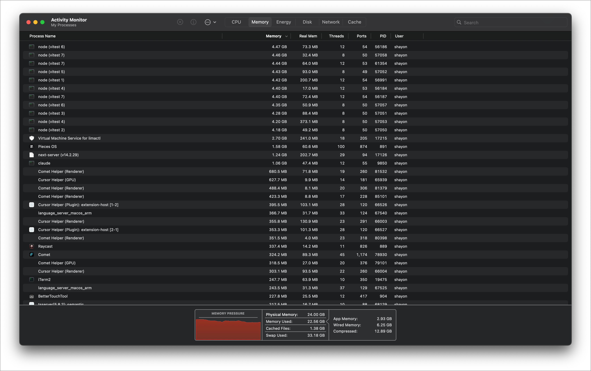
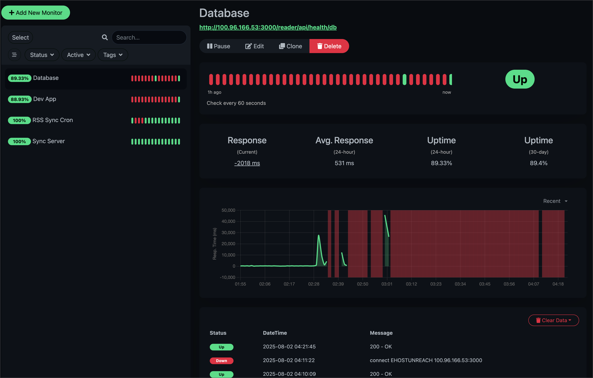

# URGENT: Fix test runner causing memory exhaustion and service outages

**Priority:** URGENT  
**Due Date:** August 2, 2025 at 8:00 PM  
**Status:** TODO

## Problem

Running the test suite caused severe resource exhaustion on the development machine:
- 8 vitest processes spawned, each consuming 4-4.5GB memory (~36GB total)
- Database and other services crashed due to memory pressure
- Required manual intervention to kill all vitest processes

## Root Causes

1. **npm test script runs tests twice**: Current script is `vitest run && vitest run --config vitest.config.integration.ts`
2. **No resource limits**: Vitest spawns unlimited concurrent processes
3. **No timeout handling**: Orphaned processes accumulate when tests timeout
4. **Running full test suite**: 364 tests running concurrently is too resource-intensive

## Impact

- Development machine became unresponsive
- Database went down (Uptime Kuma showed outages)
- All PM2 services affected
- Required manual process cleanup

## Proposed Solutions

1. Fix npm test scripts to avoid double execution
2. Add resource limits to vitest config (max forks, memory limits)
3. Create safe test runner script with automatic cleanup
4. Add monitoring for test processes
5. Move heavy testing to CI/GitHub Actions
6. Document safe test execution practices

## Acceptance Criteria

- [ ] npm test only runs tests once
- [ ] Vitest config has resource limits (max 2 concurrent forks)
- [ ] Safe test runner script with timeouts and cleanup
- [ ] Test monitoring script to check for orphaned processes
- [ ] Documentation on safe test practices
- [ ] Emergency kill commands documented

## Immediate Workaround

Until this is fixed, use these commands for safer test execution:

```bash
# Kill any existing vitest processes
pkill -f vitest

# Run specific test files only
npx vitest run --no-coverage src/__tests__/unit/specific-test.test.ts

# Monitor test processes
ps aux | grep vitest
```

## Evidence

- **Memory Usage**: 
- **Service Outage**: 