# Agent Workflow Redesign: Primary Agent as Interactive PM

## Overview

This redesign addresses the fundamental constraints of sub-agents:
1. They cannot interact with users directly
2. They cannot invoke other sub-agents
3. Each invocation starts with zero context from previous runs

All user interaction and agent orchestration flows through the Primary Agent, who acts as the interactive Program Manager.

## Core Architecture


## Key Principles

1. **Primary Agent Owns All Orchestration**: User interaction AND agent coordination
2. **Sub-Agents Are Stateless Executors**: No memory between calls, no inter-agent communication
3. **Database Context Problem**: Since agents can't call db-expert, critical agents need Supabase access
4. **Request More Info Pattern**: Sub-agents return structured "need_more_info" responses (minimize usage)
5. **Context Must Be Explicit**: Primary must pass all needed context in each call
6. **No Unauthorized File Operations**: Only analyze/execute workflow can write files after proper Linear tracking
7. **Branch Strategy**: dev branch for development, main branch for production releases

## Standardized Agent Roles

### Agents with Supabase Access
Since agents cannot call db-expert, these agents need direct Supabase access with context:

1. **db-expert**: Primary database operations, schema management, optimization
   - Has: Full Supabase access, schema knowledge, RLS policies
   - Context: Connection strings, service role key, table structures
   
2. **devops-expert**: Infrastructure, sync monitoring, service health
   - Has: Read-only Supabase access for health checks
   - Context: Sync_metadata table, API usage tracking, service configs
   
3. **test-expert**: Testing & QA with data verification
   - Has: Test-scoped Supabase access
   - Context: Test database patterns, expected data structures

### Agents without Supabase Access
1. **linear-expert**: Linear MCP Server operations only
2. **docs-expert**: File system and documentation operations  
3. **ui-expert**: Frontend code and PWA features
4. **git-expert**: Git operations, commit coordination
5. **release-expert**: Build and deployment (dev → main)

### Documentation Ownership Model
Since docs-expert cannot be called by other agents:

**Primary Agent coordinates documentation:**
- Gets domain content from specialists
- Passes to docs-expert for file operations
- Each expert owns their domain knowledge but not files

**Domain Ownership:**
- **db-expert**: Database schemas, migrations, optimization guides
- **devops-expert**: Deployment configs, monitoring setup, sync documentation
- **test-expert**: Test strategies, coverage reports
- **ui-expert**: Component docs, PWA guidelines
- **release-expert**: Release procedures, changelog entries

## Read-Only Agent Variants (Option A)

### Agents That Need Read-Only Variants

For commands that prohibit file operations (`/capture-idea`, `/next-task`, `/health-check`, `/analyze`), we create read-only variants:

1. **db-expert-readonly**
   - Tools: `Glob, Grep, LS, Read, NotebookRead, TodoWrite, ListMcpResourcesTool, ReadMcpResourceTool, mcp__supabase__*` (all Supabase MCP tools)
   - NO: Edit, MultiEdit, Write, NotebookEdit

2. **devops-expert-readonly**  
   - Tools: `Task, Bash, Glob, Grep, LS, Read, TodoWrite, WebFetch, mcp__perplexity__perplexity_ask, mcp__server-brave-search__*`
   - NO: Edit, MultiEdit, Write

3. **docs-expert-readonly**
   - Tools: `Bash, Glob, Grep, LS, Read, NotebookRead, WebFetch, TodoWrite, WebSearch, ListMcpResourcesTool, ReadMcpResourceTool`
   - NO: Edit, MultiEdit, Write, NotebookEdit

### Agents Already Read-Only (No Changes Needed)
- **linear-expert**: Only has Linear MCP tools
- **test-expert**: Already lacks write tools
- **ui-expert**: Already lacks write tools  

### Usage Pattern
```
if (command in ['/capture-idea', '/next-task', '/health-check']) {
  use db-expert-readonly
  use devops-expert-readonly  
  use docs-expert-readonly
} else if (command === '/analyze') {
  use read-only variants until plan approved
} else if (command === '/execute') {
  use full-permission agents
}
```

## Workflow Patterns

### Pattern 1: Interactive Information Gathering


### Pattern 2: Sub-Agent Needs More Info (Minimize This)


**When re-invoking, Primary MUST include:**
- Original request context
- Results from previous run
- Newly gathered information
- Clear directive on what to do differently

### Pattern 3: Database Context Handling


## Redesigned Workflows

### 1. Capture Idea Workflow (🚫 No File Operations)


### 2. Next Task Workflow (🚫 No File Operations)


### 3. Analyze & Execute Workflow (With Safety Gates)

```mermaid
graph TD
    Start[User: /analyze RR-123] --> GetIssue[linear-expert: Get Full Issue + Comments]
    
    GetIssue --> ParseSpec{Primary: Parse Specification}
    ParseSpec --> DBCheck{Involves Database?}
    
    DBCheck -->|Yes| DBFirst[db-expert-readonly: Get Schema/Context]
    DBCheck -->|No| Coordinate[Primary: Coordinate Analysis]
    
    DBFirst --> PassContext[Primary: Package DB Context]
    PassContext --> Coordinate
    
    Coordinate --> A1[docs-expert-readonly: Get Project Context]
    Coordinate --> A2[test-expert: Draft Test Plan<br/>WITH DB Context if needed]
    Coordinate --> A3[Primary: Check Dependencies]
    
    A1 --> Synthesize{Primary: Synthesize Analysis}
    A2 --> Synthesize
    A3 --> Synthesize
    
    Synthesize --> DocPlan[Primary: Document Plan in Linear]
    DocPlan --> DocTests[Primary: Document Test Cases in Linear]
    DocTests --> Present[Primary: Present Analysis<br/>⚠️ NO FILE OPERATIONS]
    
    Present --> Approve{User: Approve Plan?}
    
    Approve -->|Yes| Execute[User: /execute RR-123]
    Approve -->|No| Refine[Primary: What needs adjustment?]
    
    Execute --> Gate{Primary: Verify Gates}
    Gate -->|Missing Plan| Error1[❌ Need documented plan]
    Gate -->|Missing Tests| Error2[❌ Need test cases]
    Gate -->|Not In Progress| Error3[❌ Update status first]
    Gate -->|All Good| E1[linear-expert: Confirm In Progress]
    
    E1 --> E2[test-expert: Write Tests First]
    E2 --> E3[Primary: NOW Can Write Files]
    E3 --> E4[test-expert: Run All Tests]
    E4 --> E5[linear-expert: Update to In Review]
    E5 --> E6[git-expert: Commit Changes?]
    
    style ParseSpec fill:#ffa
    style DBCheck fill:#ffa
    style PassContext fill:#ffa
    style Coordinate fill:#ffa
    style Synthesize fill:#ffa
    style Present fill:#ffa
    style Gate fill:#f99
    style E3 fill:#9f9
```



### 4. Health Check Workflow (🚫 No File Operations)


## Slash Command Redesign

### Enhanced Existing Commands

#### `/capture-idea` (Enhanced)
```markdown
# Capture New Idea or Bug

Enhanced with better interaction flow:
- Primary Agent handles ALL user interaction
- Smart duplicate detection with user confirmation
- Progressive information gathering (can skip at any time)
- Batched data sent to linear-ops for creation

Arguments: [type] [brief-description]
Special: Type 'done' at any prompt to skip remaining questions
```

#### `/next-task` (Enhanced)
```markdown
# What Should I Work On Next?

Enhanced with intelligent filtering:
- Primary Agent scores tasks based on multiple factors
- Considers time of day, current load, dependencies
- Presents reasoned recommendations
- One-click task activation

Arguments: [quick|impact|bug|feature]
New: Shows warning if approaching 3-task limit
```

#### `/analyze` (Restructured)
```markdown
# Analyze Linear Issue

Restructured for better flow:
- Primary Agent maintains conversation context
- Parallel analysis from multiple specialists
- Interactive refinement of analysis
- Clear separation between analysis and execution

Arguments: <issue-id> or <idea-description>
Note: Stays in read-only mode until explicit /execute
```

### New/Modified Slash Commands

#### `/wrap-up` - End of Session
```markdown
# Wrap Up Current Work

Clean session ending:
- Commits work-in-progress (if desired)
- Updates Linear with progress
- Parks incomplete tasks
- Suggests tomorrow's priorities

No arguments needed
```

## Communication Patterns

### Primary Agent Language

**For Questions:**
```
"Let me understand better - is this affecting all users or just some?"
"Would you prefer a quick fix now or a proper solution later?"
"I found 3 similar issues. Here's a quick summary..."
```

**For Decisions:**
```
"Based on the analysis, I recommend..."
"There's a trade-off here: A gives you X but costs Y..."
"This conflicts with your earlier requirement. Which should take priority?"
```

**For Status:**
```
"I'm checking with our database expert..."
"Running health checks across all systems..."
"All specialists have reported back. Here's what I found..."
```

### Sub-Agent Response Format

All sub-agents return structured data:

```json
{
  "agent": "database-expert",
  "operation": "analyze_performance",
  "status": "success|need_more_info|error",
  "data": {...},
  "need_more_info": {
    "reason": "Need table names to analyze",
    "requested_data": ["table_names", "time_range"],
    "suggested_primary_action": "Ask user which tables to focus on"
  },
  "metadata": {
    "duration": "320ms",
    "db_calls": 3
  }
}
```

Primary Agent handles `need_more_info` by gathering data and re-invoking.

## Agent Context Requirements

### When Agents Need Extra Context

1. **db-expert**: 
   - Always needs: Current operation type
   - Always has: SUPABASE_URL, SUPABASE_SERVICE_ROLE_KEY from env
   - Sometimes needs: Table names, time ranges, specific queries
   - Minimize: Requests for more info by passing comprehensive initial context

2. **devops-expert** (includes sync monitoring):
   - Always needs: Component to check (services/sync/network)
   - Always has: SERVER_PORT, PROD_PORT, DEV_PORT, sync configs
   - Sometimes needs: Error patterns, time windows, specific service names
   - Key context: SYNC_MAX_ARTICLES=300, ARTICLES_RETENTION_LIMIT=1000

3. **test-expert**:
   - Always needs: What to test, Linear issue spec
   - Always has: Test DB access, TEST_INOREADER credentials
   - Sometimes needs: Database schema (from db-expert), recent changes

4. **linear-expert**:
   - Always needs: Operation type and required fields
   - Uses: Linear MCP Server (not direct API)
   - Never needs external context (self-contained)

5. **docs-expert**:
   - Always needs: Document type or search query
   - Sometimes needs: Content from domain experts
   - Cannot be called by other agents - Primary coordinates

### API Ownership

**External APIs:**
- **Inoreader API**: devops-expert (OAuth tokens at ~/.rss-reader/tokens.json)
- **Linear MCP Server**: linear-expert exclusively
- **Supabase API**: db-expert (with service role key)
- **Claude/Anthropic API**: Primary Agent only (for summaries)

**Internal APIs (RSS Reader):**
- **/api/sync**: devops-expert owns documentation and monitoring
- **/api/feeds & /api/articles**: db-expert owns schema documentation
- **/api/health**: devops-expert owns endpoints and monitoring
- **All API route handlers**: Primary Agent implements, specialists document

## File Operation Safety Rules

### Commands That CANNOT Write Files:
- **/capture-idea**: Only updates Linear
- **/next-task**: Only reads and updates Linear status
- **/health-check**: Read-only system checks
- **/wrap-up**: Only updates Linear with progress

### Only /execute Can Write Files After:
1. Issue has been analyzed (/analyze completed)
2. Implementation plan documented in Linear
3. Test cases documented in Linear  
4. Issue status is "In Progress"
5. User has explicitly approved

### Primary Agent Enforces:
```
if (command !== '/execute') {
  preventAllFileWrites();
}

if (command === '/execute') {
  verifyLinearGates();
  if (!allGatesPassed) {
    preventAllFileWrites();
    explainWhatsMissing();
  }
}
```

## Migration Strategy

### Phase 1: Rename and Consolidate Agents
- Rename all agents to *-expert pattern
- Rename database-expert to db-expert
- Merge sync-monitor into devops-expert
- Grant Supabase access with context to db-expert, devops-expert, test-expert

### Phase 2: Update Slash Commands
- Remove: /task-status, /daily-standup, /quick-fix, /interrupt
- Add file operation gates to all commands
- Update /execute with Linear verification

### Phase 3: Minimize need_more_info Pattern
- Design agents to work with initial context
- When unavoidable, Primary passes cumulative context

### Phase 4: Implement Documentation Coordination
- Primary gets content from domain experts
- Primary passes to docs-expert for file ops
- No direct expert-to-expert documentation

## Example: Sub-Agent Needs More Info


**devops-expert response:**
```json
{
  "agent": "devops-expert",
  "status": "need_more_info",
  "need_more_info": {
    "reason": "Multiple sync runs found",
    "requested_data": ["timeframe", "specific_sync_type"],
    "context": "Found 47 sync runs in logs"
  }
}
```

## Benefits of This Redesign

1. **Respects Sub-Agent Constraints**: No agent-to-agent communication, stateless execution
2. **Solves Database Context**: Key agents have direct Supabase access
3. **Standardized Naming**: All agents follow *-expert pattern
4. **Consolidated Responsibilities**: Sync monitoring merged into devops-expert
5. **Clear API Ownership**: Each external API has a designated owner
6. **Flexible Context Handling**: "need_more_info" pattern allows iterative refinement
7. **No Git Complexity**: Removed PR/branch workflows since you work on main

## Common Patterns to Remember

1. **No Sub-Agent Chaining**: Only Primary → Sub-Agent → Primary
2. **Context Must Be Explicit**: Each invocation starts fresh
3. **Database Context Strategy**: Get from database-expert first, pass to others
4. **Parallel When Independent**: But remember results must be synthesized by Primary
5. **Structured Responses Always**: Even errors follow the pattern
6. **Primary Owns All Decisions**: Sub-agents just execute and report

## Git Operations & Release Flow

### When Git-Expert Gets Involved

1. **After /execute Completion**: 
   - Primary asks if you want to commit
   - git-expert handles staging, commit messages, Linear references
   
2. **Release Flow (dev → main)**:
   - release-expert prepares the release
   - git-expert handles the merge from dev to main
   - Coordinates with linear-expert to update issue statuses

3. **Important**: git-expert already has proper tool restrictions (no Edit/Write/MultiEdit)

## Implementation Priority

1. **First**: Create linear-expert with Linear MCP Server integration
2. **Second**: Create read-only variants: db-expert-readonly, devops-expert-readonly, docs-expert-readonly
3. **Third**: Rename database-expert to db-expert in all existing agents
4. **Fourth**: Update devops-expert to absorb sync monitoring with DB context
5. **Fifth**: Grant Supabase access with proper context to db-expert, devops-expert, test-expert
6. **Sixth**: Implement command-based agent selection in Primary (read-only vs full)
7. **Seventh**: Update documentation ownership model (Primary coordinates)
8. **Last**: Test the complete workflow with all safety gates

## Key Workflow Principles

### Branch Strategy
- **dev branch**: All development work happens here
- **main branch**: Production releases only
- **No feature branches**: Work directly on dev

### File Operation Control
```
/capture-idea → 🚫 No files, only Linear
/next-task → 🚫 No files, only Linear
/health-check → 🚫 No files, read-only
/analyze → 🚫 No files until approved
/execute → ✅ Files ONLY after gates passed
```

### Linear as Source of Truth
1. All work must be tracked in Linear
2. Implementation plans must be documented
3. Test cases must be documented
4. Status must be "In Progress" before coding

### Documentation Coordination
Since docs-expert cannot be called by other agents:
- Domain experts provide content knowledge
- Primary Agent gets content and passes to docs-expert
- docs-expert handles all file operations
- Each expert owns their domain knowledge, not files

This design embraces the constraints rather than fighting them, creating a reliable system that respects your workflow requirements and safety preferences.