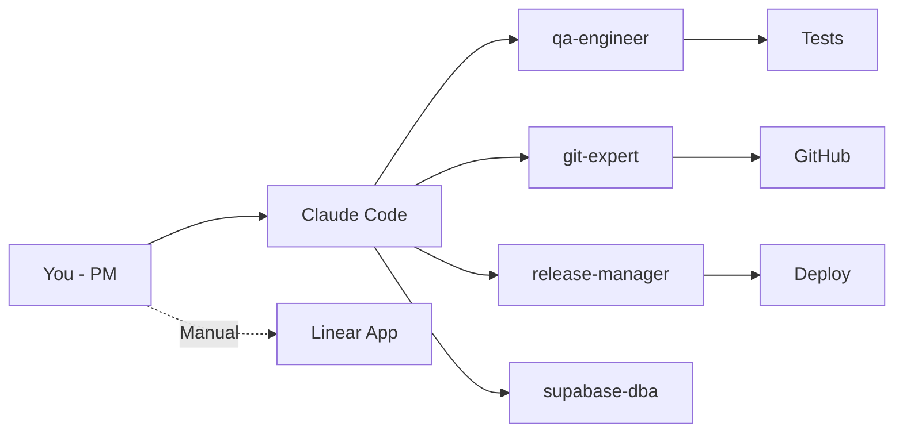
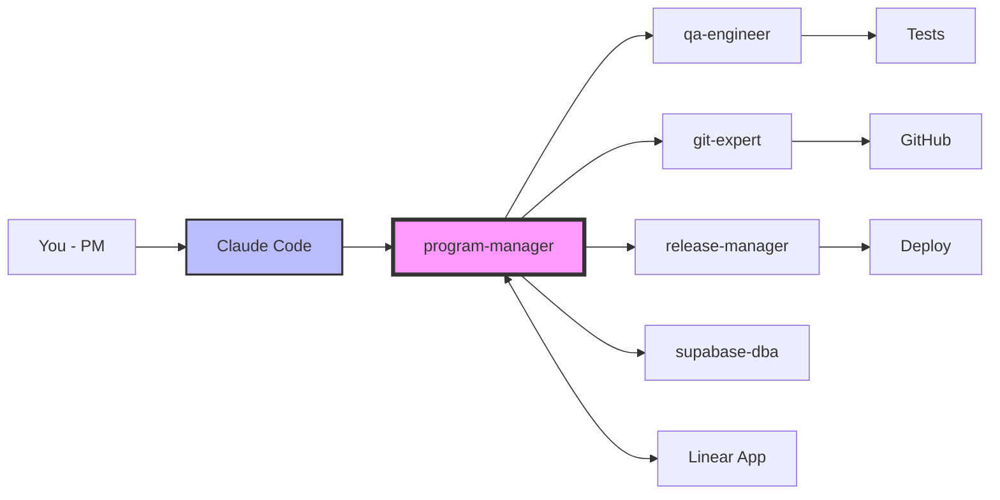
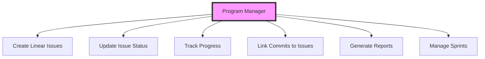
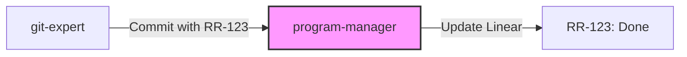
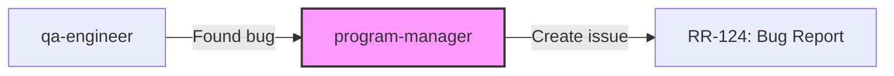
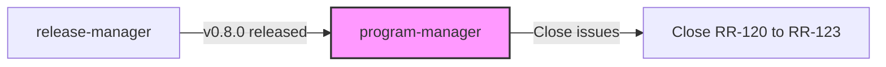
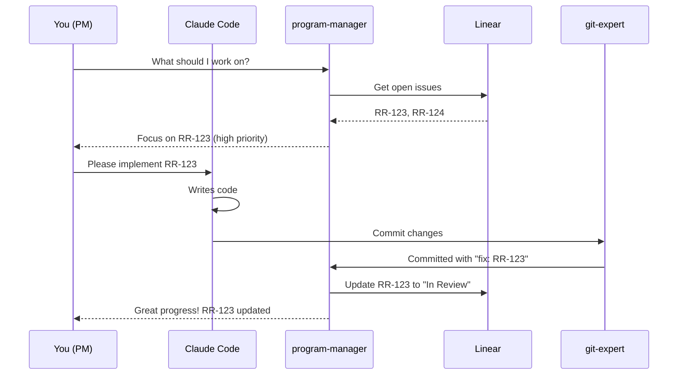

# Program Manager Agent Integration

## Current Flow (Without Program Manager)


## New Flow (With Program Manager)


## Program Manager Tasks


## Integration Points (Minimal Enhancement)

### 1. Git Expert Integration


### 2. QA Engineer Integration  


### 3. Release Manager Integration


## Daily Workflow Example



## Quick Visual Summary

### Before Program Manager
```
You (PM) → Claude Code → Code gets written → You manually update Linear (often forget)
```

### After Program Manager  
```
You (PM) → Claude Code → program-manager → Linear updates automatically
```

### Key Benefits
- 🤖 **Automatic Linear sync**
- 📊 **Progress tracking**
- 🎯 **Daily focus lists**
- 🔗 **Links commits to issues**
- 📈 **Sprint reports**