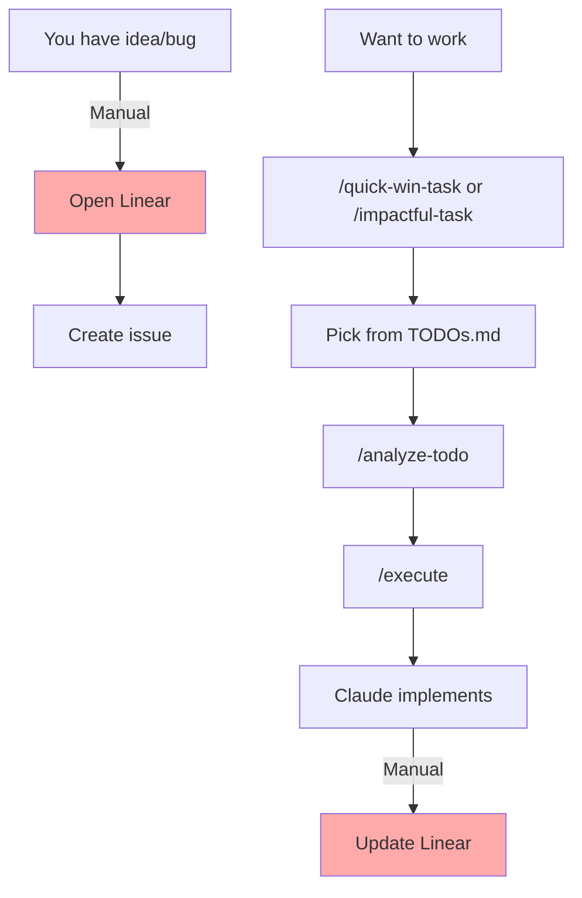
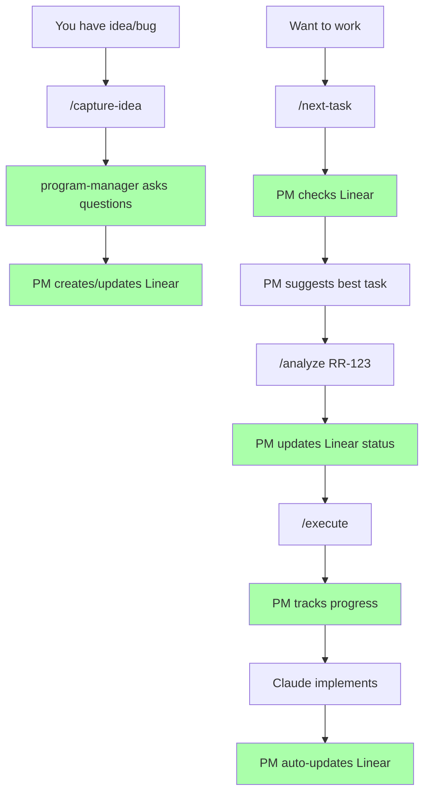
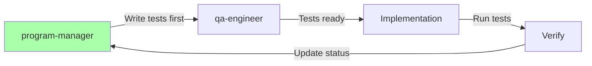

# Program Manager Workflow Redesign

## Current Workflow (Manual Linear)


## New Workflow (Automated with PM)


## New Slash Commands

### 1. `/capture-idea` - Quick Idea/Bug Capture
```markdown
# Capture Idea or Bug

I have an idea or bug to capture. Invoke the `program-manager` agent to:

1. Ask me investigative questions one at a time:
   - Is this a bug or feature idea?
   - Brief description?
   - User impact (1-5)?
   - Any blocking issues?
   - Related to existing features?

2. Search Linear for related issues

3. Either:
   - Update existing issue with new info
   - Create new issue with proper labels

4. Return the Linear issue ID for reference
```

### 2. `/next-task` - Smart Task Selection
```markdown
# What Should I Work On Next?

Invoke the `program-manager` agent to:

1. Check my Linear workspace for:
   - Open issues in current cycle
   - Priority levels
   - Dependencies
   - My recent activity

2. Consider:
   - Quick wins vs impactful tasks
   - Current time (late night = simpler tasks)
   - What's blocking other work

3. Suggest top 3 options with reasoning

4. Update selected issue to "In Progress"
```

### 3. `/analyze` - Enhanced Analysis
```markdown
# Analyze Linear Issue

Invoke the `program-manager` agent to:

1. Get full context from Linear issue $ARGUMENTS
2. Check related issues and dependencies
3. Coordinate with `doc-admin` for project context
4. Create implementation plan
5. Ask `qa-engineer` to draft test scenarios
6. Update Linear with the plan
7. Present summary in PM-friendly language

Wait for approval before proceeding.
```

### 4. `/execute` - Enhanced Execution
```markdown
# Execute Implementation

Prerequisites: Must have analyzed issue first

Invoke the `program-manager` agent to orchestrate:

1. Update Linear: "In Development"
2. Ask `qa-engineer` to write unit tests FIRST
3. Implement the solution
4. Run tests continuously during development
5. Get reviews from relevant agents
6. Update Linear with progress notes
7. When complete, update Linear: "In Review"

Report implementation summary and wait for approval.
```

## Unit Test Integration



## Program Manager Smart Rules

### 1. **Issue Creation Intelligence**
- Check for existing labels and apply appropriately
- Search for duplicate issues before creating
- Check existing projects and assign correctly
- New issues ALWAYS go to "Backlog" status
- Auto-link related issues

### 2. **Issue Hierarchy Management**
- Analyze if issue should be standalone or sub-issue
- Break large tasks into sub-issues automatically
- Maintain parent-child relationships
- Track completion percentages

### 3. **Dependency Tracking**
- Identify blocking/blocked-by relationships
- Coordinate with relevant agents:
  - `supabase-dba` for DB dependencies
  - `sync-reliability-monitor` for sync dependencies
  - `devops-expert` for deployment dependencies
- Document all dependencies in Linear

### 4. **Linear Status Flow**
```
Backlog → Todo → In Progress → In Review → Done
                      ↓
                  Canceled/Duplicate
```

## Health Check Command

### `/health-check` - System Health Monitor
```markdown
# Check System Health

Invoke these agents in parallel to verify system health:

1. `devops-expert`:
   - PM2 service status (all 4 services)
   - Memory usage per service
   - Recent restarts count
   - Port availability (3147, 3000, 3001)

2. `sync-reliability-monitor`:
   - Last automatic sync (2 AM/2 PM)
   - Last manual sync status
   - Sync queue status (5+ items trigger)
   - Bi-directional sync health
   - API rate limit usage (X/100)

3. `supabase-dba`:
   - Database connection health
   - Materialized view freshness
   - RLS policy status
   - Sync_metadata table status

Return consolidated health report with:
- 🟢 All systems operational
- 🟡 Warnings (list issues)
- 🔴 Critical issues (immediate action needed)
```

## RSS Reader Specific Customizations

### For Program Manager:
- Track Inoreader API usage (100/day limit)
- Monitor sync pipeline issues
- Coordinate OAuth token refreshes
- Track PWA-specific bugs separately

### For Issue Templates:
- **Sync Issues**: Auto-assign sync-reliability-monitor
- **DB Performance**: Auto-assign supabase-dba
- **UI/PWA Issues**: Auto-assign ux-engineer
- **Deployment**: Auto-assign devops-expert

## Key Benefits

1. **No Manual Linear Updates** - Everything automated
2. **Test-First Development** - Unit tests before code
3. **Smart Task Selection** - Based on Linear data
4. **Progress Tracking** - Real-time Linear updates
5. **Context Preservation** - All info in Linear
6. **Intelligent Issue Management** - No duplicates, proper hierarchy
7. **Health Monitoring** - Proactive system checks

## Migration Path

Phase 1: Add program-manager agent
Phase 2: Create new slash commands
Phase 3: Update existing agents with PM hooks
Phase 4: Deprecate old commands gradually